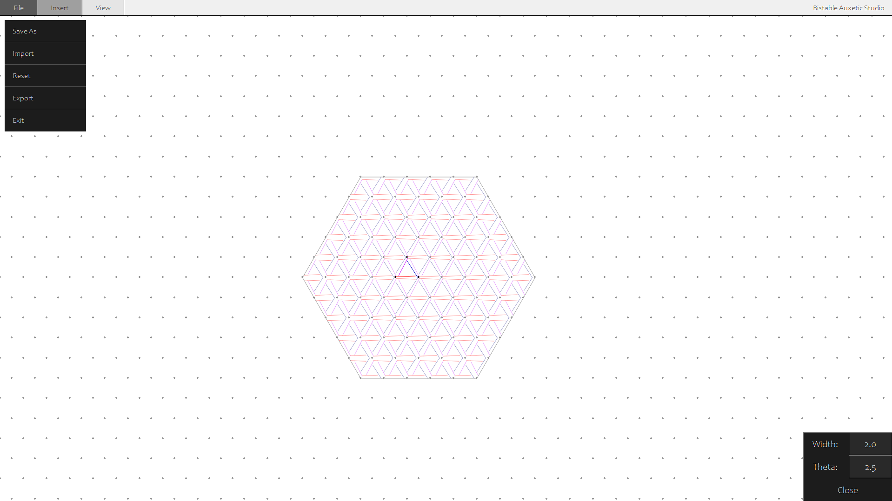

# ```Bistable Auxetic Studio (Work In Progress)```



## ```Overview:```

A lightweight application to create Bistable Auxetic Surfaces, programmed in pure python, with an intuitive Graphical User Interface (GUI). The application currently focuses on triangular cells. Patterns can be exported as `.svg` files for lasercutting and are stored in the form of `.baux` files. Help to simulate Material Deformation would be appreciated 🙂. For more information, see Acknowledgments and Credits.

## ```Installation and Use:```

Dependencies:

- [`NumPy`](https://numpy.org/install/)  
- [`PyGame`](https://www.pygame.org/)
- [`Draw2Svg`](https://pypi.org/project/draw2Svg/)
- `Math`
- `Tkinter`
- `Ctypes`
- `...`

## ```TODO:```

- [ ] There is a bug which makes the application crash about every 1 in 8 times, due to a Python GIL error.
- 
- [ ] I am currently investigating FEM simulations to visualise and predict the deployed state:
- 
- [ ] The data from FEM could be fed into a CNN (Convolutional Neural Network) to efficiently predict the deployed state.

##  ```Completed:```

- [x] Cells take any positive Thickness and Theta value, regardless of whether it is realistic or not. (Thickness should ideally be less than 30% of Cell Size, and Theta should be less than 30 Degrees)
      
## ```Acknowledgements and Credits:```

This program (a high school project) is based off the paper: ['Bistable Auxetic Surface Structures'](https://www.julianpanetta.com/pdf/bistable_auxetics.pdf) by Tian Chen, Julian Panetta, Max Schnaubelt and Mark Pauly, though there is no personal or professional affiliation with them.
